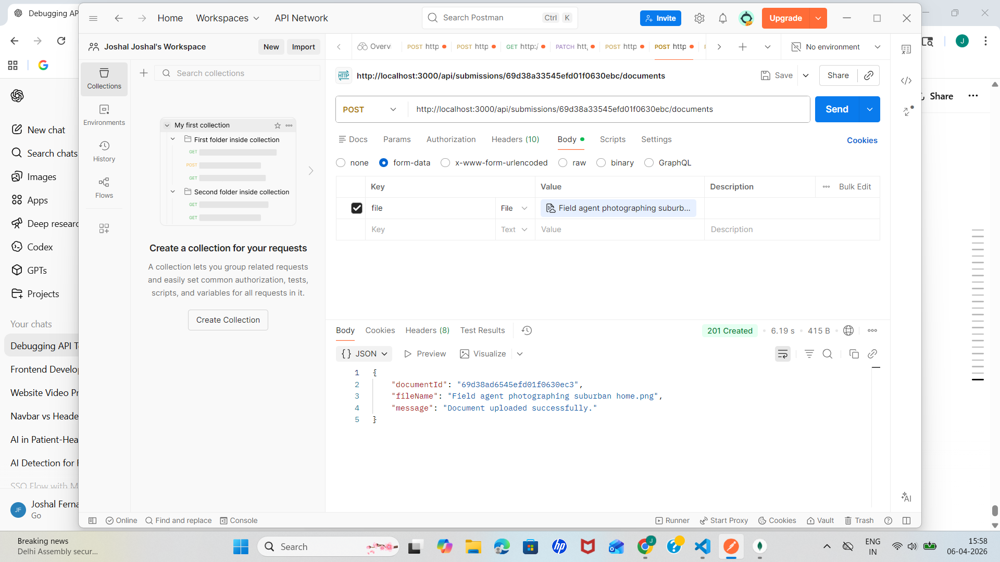
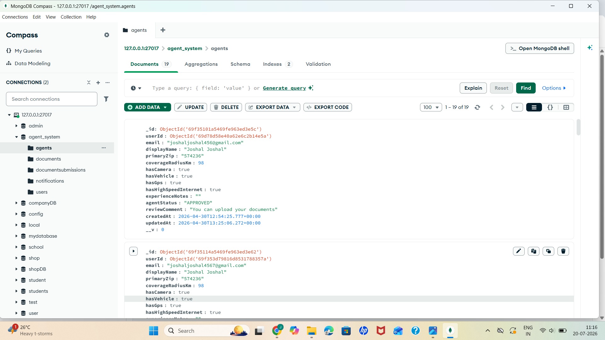

# Field Agent Onboarding and Document Verification Workflow – Backend

## Overview

This repository contains the backend of the **Field Agent Onboarding and Document Verification Workflow** project.

The backend is responsible for managing field agent registration, authentication, document submission, verification workflow, and communication between the frontend and the database through APIs.

## Key Features

* Field agent registration and login
* Secure authentication and authorization
* Agent profile management
* Document upload and storage
* Document verification workflow
* Verification status tracking
* Admin functionality for reviewing submitted documents
* REST API integration with the frontend
* Database management for agent and document information

## Backend Responsibilities

The backend handles:

* Receiving requests from the frontend
* Validating user and agent information
* Processing authentication
* Managing agent onboarding data
* Handling uploaded document information
* Updating document verification status
* Storing and retrieving data from the database
* Sending appropriate API responses to the frontend

## Project Workflow

1. A field agent registers through the frontend.
2. Registration details are sent to the backend through APIs.
3. The backend validates and stores the agent information.
4. The agent submits the required documents.
5. Document details are processed and stored by the backend.
6. The admin/reviewer verifies the submitted documents.
7. The verification status is updated as **Pending**, **Approved**, or **Rejected**.
8. The updated status is displayed to the field agent through the frontend.

## Project Structure

```text
backend/
├── controllers/      # Handles application logic
├── models/           # Database models and schemas
├── routes/           # API routes
├── middleware/       # Authentication and other middleware
├── config/           # Database and application configuration
├── uploads/          # Uploaded documents, if stored locally
├── .env              # Environment variables
├── package.json      # Project dependencies
└── server.js         # Backend entry point
```

> The exact folder structure may vary depending on the implementation.

## Technologies Used

- **Node.js** – Used as the backend runtime environment.
- **Express.js** – Used to build RESTful APIs and handle HTTP requests.
- **MongoDB** – Used as the database for storing field agent, user, and document-related information.
- **Mongoose** – Used for MongoDB object modeling and database operations.
- **JWT (JSON Web Token)** – Used for secure authentication and authorization.
- **bcrypt** – Used for securely hashing user passwords.
- **Multer** – Used for handling document/file uploads.
- **REST API** – Used for communication between the frontend and backend.
- **Postman** – Used for testing and validating backend API endpoints.
- **Git & GitHub** – Used for version control and source code management.

## Backend API Testing

The backend REST APIs were tested using **Postman** to verify that different operations such as registration, login, agent management, document submission, and verification were working correctly.


### Document Submission API



## Database Screenshots

The application uses a database to store and manage field agent information, authentication details, submitted documents, and verification status.

### Agent Data



### User Data


### Document Data


## Installation and Setup

### 1. Clone the Repository

```bash
git clone <your-backend-repository-url>
cd <backend-folder-name>
```

### 2. Install Dependencies

```bash
npm install
```

### 3. Configure Environment Variables

Create a `.env` file in the backend root directory and add the required configuration.

Example:

```env
PORT=5000
DATABASE_URL=your_database_connection_string
JWT_SECRET=your_secret_key
```

Do not upload the `.env` file or any passwords, secret keys, or database credentials to GitHub.

### 4. Start the Backend Server

```bash
npm start
```

For development mode, if Nodemon is configured:

```bash
npm run dev
```

The backend server will typically run on:

```text
http://localhost:5000
```

## API Functionality

The backend provides APIs for operations such as:

* User/agent registration
* User login and authentication
* Agent profile management
* Document submission
* Retrieving submitted documents
* Document approval or rejection
* Verification status tracking
* Admin/reviewer operations

## Frontend Integration

The frontend of this project is maintained in a **separate GitHub repository**.

The frontend communicates with this backend using REST API requests. Make sure the backend server is running and the correct backend API URL is configured in the frontend before running the complete application.

## Security

* Sensitive credentials should be stored using environment variables.
* Passwords should be securely hashed before database storage.
* Protected API routes should use authentication and authorization.
* Uploaded documents should be validated before processing.
* The `.env` file should never be committed to GitHub.

## Purpose

The main purpose of this project is to simplify and digitize the field agent onboarding process. It provides an organized workflow for collecting agent information, submitting required documents, verifying those documents, and tracking onboarding status efficiently.

## Future Enhancements

* Email or SMS notifications for verification updates
* Automated document validation
* Cloud-based document storage
* Role-based access control
* Improved admin dashboard
* Audit logs for document verification activities

## Author

**Joshal Fernandes**

Computer Science and Engineering
IoT with Cybersecurity and Blockchain Technology
